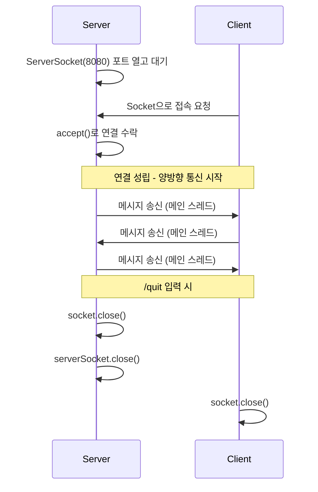

## 01. TCP 1:1 채팅

### 목표
TCP Socket으로 서버-클라이언트 간 양방향 실시간 메시지 통신 구현

### 설계 과정

### 1. 왜 이 프로젝트를 했는가?
배치 시스템과 API연동 서버를 개발하면서 서버 간 통신에 관심이 생겼지만 실무에서 Socket을 직접 다뤄볼 기회가 없어 아쉬웠다. 
그러다보니 TCP Socket과 WebSocket의 차이, 그리고 TCP Socket이 동작하는 구조가 궁금했다. 
**TCP Socket이 실제로 어떻게 연결되고 데이터를 주고받는지 직접 구현하며 이해하고 싶어서** 해당 프로젝트를 시작했다.

### 2. 구조를 어떻게 설계했는가?
#### 2.1. 서버/클라이언트
| 역할 | 설명 |
|---|---|
| 서버 | ServerSocket으로 포트를 열고 클라이언트의 접속을 대기 |
| 클라이언트 | Socket으로 서버에 직접 접속을 요청 |

#### 2.2. 메시지 송수신 방법
- 연결 후에는 양쪽 다 동일한 방식으로 메시지 송수신한다.

**통신 흐름**

**스트림 구조**
| 방향 | 클래스 | 역할 |
|---|---|---|
| 수신 | InputStream -> InputStreamReader -> BufferedReader | 바이트를 문자로 변환하고, 한 줄 단위로 읽기 이해 순서대로 감싸는 구조 |
| 송신 | OutputStream -> PrintWriter(autoFlush) | 문자열을 바이트로 변환하여 즉시 전송 |

**스레드 분리**
| 스레드 | 담당 | 이유 |
|---|---|---|
| 메인 스레드 | 송신(키보드 입력 -> 상대방에게 전송) | 사용자 입력을 대기하는 역할 |
| 별도 스레드 | 수신(상대방 메시지 -> 콘솔 출력) | 같은 스레드에서 하면 입력 중에 상대방 메시지를 받을 수 없기 때문에 분리 |

### 3. 실행 방법
1. ChatServer 실행
2. ChatClient 실행
3. 각 콘솔에서 메시지 입력 시 상대방에게 전송
4. "/quit" 입력 시 종료

### 4. 어떤 문제를 만났고 어떻게 해결했는가?
#### 4.1 Connection Refused 에러
- 원인: 클라이언트를 먼저 실행해서 접속할 서버가 없었다.
- 해결: TCP Socket은 서버가 먼저 포트를 열고 대기해야 클라이언트가 접속할 수 있다는 것을 확인.

### 5. 배운 점
- ServerSocket은 접속을 받는 역할, Socket은 실제 통신 역할.
- Thread를 분리해야 양방향 동시 통신이 가능하다.
- TCP Socket은 연결을 유지한 상태에서 데이터를 주고받는 방식이다.
- 연결 전에는 서버/클라이언트 역할이 다르지만, 연결 후에는 동일한 방식으로 통신한다.
