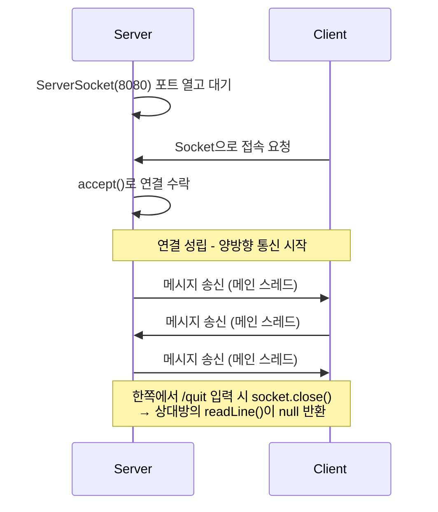

## 01. TCP 1:1 채팅

### 목표
TCP Socket으로 서버-클라이언트 간 양방향 실시간 메시지 통신 구현

### 1. 왜 이 프로젝트를 했는가?
실무에서 배치 시스템과 API 연동 서버를 개발하면서 **서버끼리는 결국 어떻게 데이터를 주고받는가**라는 질문이 계속 머릿속에 남아 있었습니다.
HTTP는 매일 다뤘지만 그것도 결국 TCP 위에서 동작하는 프로토콜이라, 한 단계 아래에서 어떤 일이 벌어지는지 직접 확인해보고 싶었습니다.

특히 평소 사용하는 카카오톡 같은 채팅 서비스가 WebSocket을 쓴다는 건 알고 있었지만, WebSocket과 TCP Socket이 정확히 무엇이 다른지, 그리고 그 차이를 이해하려면 먼저 TCP Socket이 어떤 식으로 연결되고 데이터를 주고받는지를 알아야 한다고 생각했습니다.

그래서 가장 단순한 구조(**서버 한 명, 클라이언트 한 명이 서로 메시지를 주고받는 형태**)부터 직접 만들어보면서 Socket이 동작하는 구조를 익히기로 했습니다.

### 2. 구조 설계
#### 2.1. 서버/클라이언트 역할
| 역할 | 설명 |
|---|---|
| 서버 | `ServerSocket`으로 포트를 열고 클라이언트의 접속을 대기 |
| 클라이언트 | `Socket`으로 서버에 직접 접속을 요청 |

연결 전에는 두 쪽의 역할이 다르지만 연결이 성립되고 나면 양쪽 모두 `Socket` 객체를 사용해 동일한 방식으로 메시지를 송수신하는 것을 확인 할 수 있습니다.

**서버 측: 포트 열고 대기**
```java
ServerSocket serverSocket = new ServerSocket(8080);
System.out.println("서버 시작. 클라이언트 접속 대기 중.");

Socket socket = serverSocket.accept(); // 접속이 올 때까지 이 줄에서 멈춤
```
`accept()`는 클라이언트가 접속하기 전까지 무한정 대기하다가, 접속이 들어오는 순간 실제 통신에 사용할 `Socket` 객체를 반환합니다.

**클라이언트 측: 서버에 접속 요청**
```java
Socket socket = new Socket("localhost", 8080);
System.out.println("서버 접속 완료");
```
클라이언트는 `ServerSocket` 없이 곧바로 `Socket`을 생성하면서 접속 대상(host, port)을 지정합니다.

#### 2.2. 통신 흐름


#### 2.3. 스트림 구조
Socket이 연결되면 그 위로 데이터가 흐르는 통로(스트림)를 만들어야 합니다.</br>

**1) 수신 측: `InputStream → InputStreamReader → BufferedReader`**
```java
BufferedReader in = new BufferedReader(
        new InputStreamReader(socket.getInputStream())
);
```
| 단계 | 역할 |
|---|---|
| `InputStream` | Socket에서 흘러나오는 데이터를 **바이트 단위**로 받음 |
| `InputStreamReader` | 바이트를 **문자(char)** 로 변환 (인코딩을 적용해서 사람이 읽을 수 있는 문자로 만드는 역할) |
| `BufferedReader` | 문자를 **한 줄 단위(`readLine()`)** 로 읽을 수 있게 해줌 |


**2) 송신 측: `OutputStream → PrintWriter(autoFlush=true)`**
```java
PrintWriter out = new PrintWriter(
        socket.getOutputStream(), true  // true: autoFlush 설정
);
```
- `PrintWriter`는 문자열을 바이트로 변환해 내보내는 역할을 합니다.
- 두 번째 인자 `true`는 **autoFlush** 설정으로, `println()` 호출 시점에 버퍼에 쌓아두지 않고 **즉시 전송**하라는 의미입니다.
- 채팅처럼 입력 즉시 상대방에게 보여야 하는 경우 이 옵션이 꺼져 있으면 메시지가 버퍼에 머물러 있다가 한참 뒤에 전송될 수 있어서 반드시 필요했습니다.

#### 2.4. 스레드 분리
| 스레드 | 담당 | 이유 |
|---|---|---|
| 메인 스레드 | 송신 (키보드 입력 → 상대방에게 전송) | `scanner.nextLine()`이 사용자 입력을 대기하는 동안 멈춰 있음 |
| 별도 스레드 | 수신 (상대방 메시지 → 콘솔 출력) | `in.readLine()`도 데이터가 올 때까지 멈춰 있음 |

두 작업 모두 **대기** 동작이라 같은 스레드에서 처리하면 한쪽이 막혀 있는 동안 다른 쪽이 동작할 수 없습니다.</br>
ex) 메인 스레드에서 키보드 입력을 기다리는 동안 상대방이 메시지를 보내도 받을 수 없음</br>
그래서 수신만 담당하는 스레드를 따로 띄워서 **메인은 송신, 별도 스레드는 수신**하도록 분리했습니다.

**수신 전용 스레드**
```java
Thread receiveThread = new Thread(() -> {
    try {
        String message;
        while ((message = in.readLine()) != null) {
            System.out.println("상대방: " + message);
        }
    } catch (IOException e) {
        System.out.println("연결이 종료되었습니다.");
    }
});
receiveThread.start();
```

**메인 스레드: 송신 루프**
```java
while (true) {
    String myMessage = scanner.nextLine();
    if ("/quit".equals(myMessage)) break;
    out.println(myMessage);
}
```

#### 2.5. 연결 종료 감지
`BufferedReader.readLine()`은 두 가지 경우에 멈춰 있던 상태에서 풀려납니다.

1. 상대방이 한 줄을 보냈을 때 → 그 문자열을 반환
2. 상대방이 연결을 끊었을 때 → `null` 반환

```java
while ((message = in.readLine()) != null) {
    System.out.println("상대방: " + message);
}
```
상대방이 `/quit`을 입력하면 송신 루프를 빠져나와 `socket.close()`로 연결을 끊습니다. 
그러면 서버 측의 `readLine()`이 `null`을 반환하면서 수신 루프도 자연스럽게 종료됩니다.

### 3. 실행 방법
1. `ChatServer` 실행
2. `ChatClient` 실행
3. 각 콘솔에서 메시지 입력 시 상대방에게 전송
4. `/quit` 입력 시 종료

### 4. 실행 화면
#### 4.1. 실행 시 콘솔
- `ChatServer` 접속 시</br>
</br>
- `ChatClient` 접속 시</br>
</br>
- 클라이언트가 접속 했을 때 서버 측 콘솔</br>
</br>
#### 4.2. 채팅 시 콘솔
- 서버측 채팅 시작</br>
</br>
- 클라이언트 채팅 수신</br>
</br>
- 클라이언트 답변</br>
</br>
- 서버측 채팅 수신</br>


### 5. 문제 해결 사례
#### 5.1. Connection refused 에러
| 구분 | 설명                                                                                                                      |
|---|-------------------------------------------------------------------------------------------------------------------------|
| 상황 | 코드 작성 완료 후 클라이언트를 먼저 실행하였더니 `Connection refused` 에러 발생                                                                  |
| 원인 | 서버가 아직 실행되지 않아 8080 포트에서 대기하는 프로세스가 없는 상태였습니다.</br>그러다 보니 클라이언트가 접속을 요청해도 받아줄 대상이 없어 거절당한 것이었습니다.                           |
| 해결 | TCP Socket 통신은 **서버가 먼저 포트를 열고 대기 상태가 되어야 클라이언트가 접속할 수 있다**는 순서를 확인한 뒤</br>`ChatServer` → `ChatClient` 순서로 실행하니 정상 연결되었습니다. |

### 6. 배운 점
- `ServerSocket`은 접속을 받는 역할, `Socket`은 실제 통신 역할이라는 것을 알게 되었습니다.
- Thread를 분리해야 양방향 동시 통신이 가능하다는 것을 직접 확인했습니다.
- TCP Socket은 연결을 유지한 상태에서 데이터를 주고받는 방식이라는 것을 체감했습니다.
- 연결 전에는 서버/클라이언트의 역할이 다르지만, 연결이 성립된 후에는 동일한 방식으로 통신한다는 점이 인상 깊었습니다.
