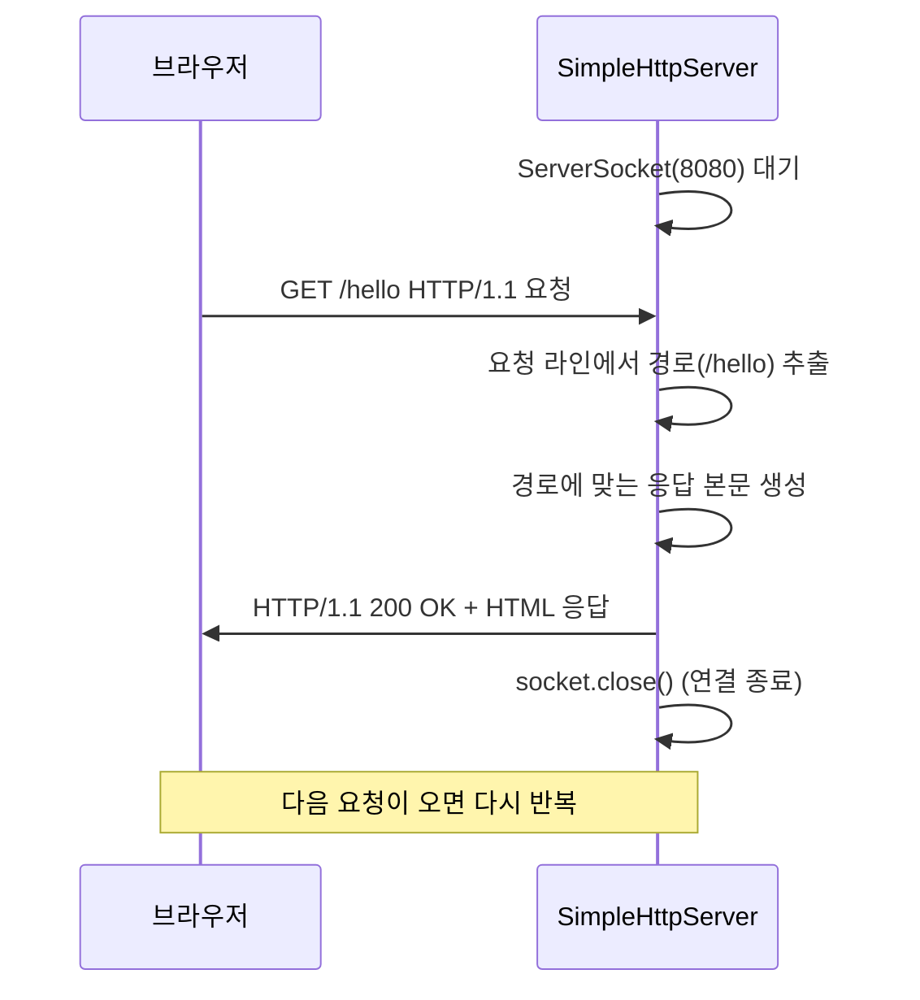

## 02. 간이 HTTP 서버

### 목표
Socket으로 HTTP 요청을 직접 받아 응답하는 서버 구현하기.

### 1. 왜 이 프로젝트를 했는가?
Spring이 내부적으로 HTTP 요청을 어떻게 처리하는지 이해하기 위해 시작하였다.

### 2. 구조를 어떻게 설계했는가?
#### 2.1. 01-tcp-chat과의 차이점
| | 01-tcp-chat | 02-http-server |
|---|---|---|
| 클라이언트 | ChatClient.java 직접 구현 | 브라우저가 대신함 |
| 연결 방식 | 한번 연결 → 계속 유지 | 요청 → 응답 → 끊김 (반복) |
| 프로토콜 | 자유 형식 텍스트 | HTTP 규격에 맞는 형식 |

#### 2.2. 요청-응답 흐름


#### 2.3. HTTP 응답 구조
```
HTTP/1.1 200 OK                    ← 상태 라인
Content-Type: text/html; UTF-8     ← 헤더 (본문 형식)
Content-Length: 22                 ← 헤더 (본문 크기)
                                   ← 빈 줄 (헤더와 본문 구분)
<h1>Hello, World!</h1>             ← 본문
```

#### 2.4. 경로별 분기 처리
| 경로 | 응답 |
|---|---|
| `/hello` | Hello, World! |
| `/time` | 현재 시간 출력 |
| 그 외 | 안내 페이지 |

### 3. 실행 방법
1. SimpleHttpServer 실행
2. http://localhost:8080/ 접속
3. /hello, /time GET 요청
4. 결과 확인

### 4. 실행 화면


### 5. 어떤 문제를 만났고 어떻게 해결했는가?


### 6. 배운 점
- HTTP도 결국 TCP Socket 위에서 동작한다
- HTTP 응답은 상태 라인 + 헤더 + 빈 줄 + 본문 구조로 이루어져 있다
- 01-tcp-chat은 연결을 유지하지만, HTTP는 요청-응답 후 연결을 끊는다
- ServerSocket은 while(true)로 계속 요청을 받기 때문에 close하지 않는다
