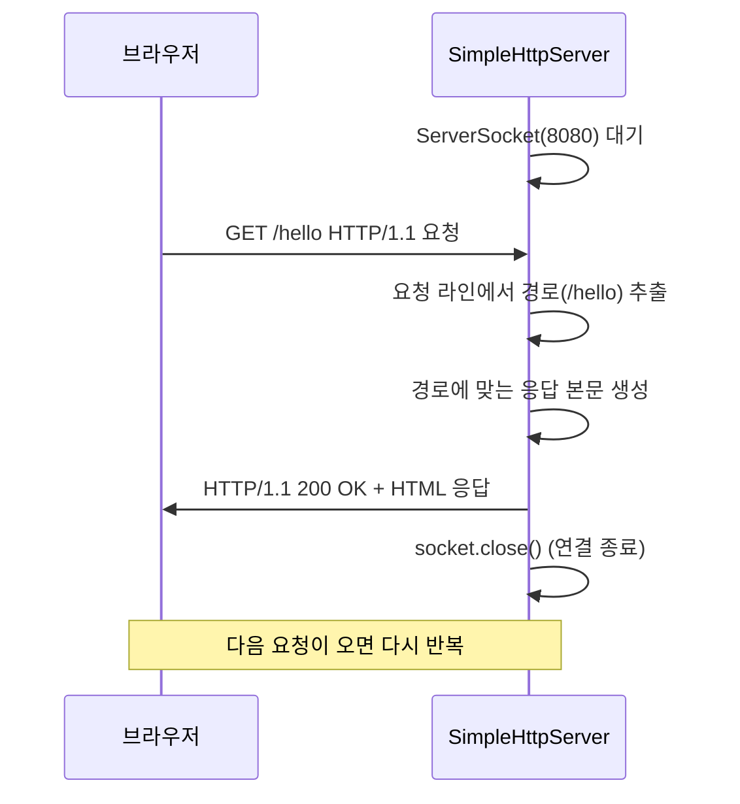

## 02. 간이 HTTP 서버

### 목표
Socket으로 HTTP 요청을 직접 받아 응답하는 서버 구현하기.

### 1. 왜 이 프로젝트를 했는가?
평소 Spring으로 개발할 때 `@GetMapping("/hello")` 한 줄이면 요청이 알아서 처리되는 것이 당연하게 느껴졌습니다.</br>
하지만 HTTP 요청이 서버에 도착했을 때 어떤 형식으로 들어오고, 어떤 형식으로 다시 내보내야 브라우저가 이해하는지는 직접 다뤄본 적이 없었습니다.</br>
그래서 Socket으로 가장 단순한 형태의 HTTP 서버를 직접 만들어보며 요청이 어떻게 들어오고 응답이 어떻게 나가는지 눈으로 확인해보고 싶었습니다.

### 2. 구조 설계
#### 2.1. 01-tcp-chat과의 차이점
| | 01-tcp-chat | 02-http-server |
|---|---|---|
| 클라이언트 | `ChatClient.java` 직접 구현 | 브라우저가 대신함 |
| 연결 방식 | 한번 연결 → 계속 유지 | 요청 → 응답 → 끊김 (반복) |
| 프로토콜 | 자유 형식 텍스트 | HTTP 규격에 맞는 형식 |

#### 2.2. 요청-응답 흐름


#### 2.3. HTTP 응답 구조
HTTP 응답은 아래 구조를 지켜야 브라우저가 본문을 제대로 해석합니다. 특히 헤더와 본문 사이의 **빈 줄**이 빠지면 브라우저가 본문을 인식하지 못합니다.
```
HTTP/1.1 200 OK                            ← 상태 라인
Content-Type: text/html; charset=UTF-8     ← 헤더 (본문 형식)
Content-Length: 22                         ← 헤더 (본문 크기)
                                           ← 빈 줄 (헤더와 본문 구분)
<h1>Hello, World!</h1>                     ← 본문
```
``` java
out.println("HTTP/1.1 200 OK");
out.println("Content-Type: text/html; charset=UTF-8");
out.println("Content-Length: " + body.getBytes("UTF-8").length);
out.println();  // 빈 줄 - 헤더와 본문의 구분선
out.println(body);
```


#### 2.4. 경로별 분기 처리
요청 라인 `"GET /hello HTTP/1.1"`을 공백으로 나누면 `["GET", "/hello", "HTTP/1.1"]`이 되고, 두 번째 값(인덱스 1)이 경로가 됩니다.</br>
이렇게 추출한 경로를 if문으로 비교해 응답 본문을 결정했습니다.
``` java
String path = "/";
if (requestLine != null && requestLine.startsWith("GET")) {
    path = requestLine.split(" ")[1];   // 공백으로 나눠서 두 번째 값
}
```

| 경로 | 응답 |
|---|---|
| `/hello` | Hello, World! |
| `/time` | 현재 시간 출력 |
| 그 외 | 안내 페이지 |

### 3. 실행 방법
1. `SimpleHttpServer` 실행
2. 브라우저에서 `http://localhost:8080/` 접속
3. `/hello`, `/time` 경로로 GET 요청
4. 결과 확인

### 4. 실행 화면
#### 4.1. `/hello` 경로 접속
</br>
#### 4.2. `/time` 경로 접속
</br>
#### 4.3. 그 외 경로 접속


### 5. 배운 점
- HTTP도 결국 TCP Socket 위에서 동작하는 **텍스트 기반 프로토콜**이라는 것을 직접 확인했습니다.
- HTTP 응답은 **상태 라인 + 헤더 + 빈 줄 + 본문** 구조를 지켜야 브라우저가 해석할 수 있습니다.
- `01-tcp-chat`은 연결을 유지하지만, HTTP는 **요청-응답 후 연결을 끊는 비연결성** 구조라는 점이 큰 차이였습니다.
- 평소 `@GetMapping` 한 줄이면 처리되던 요청 파싱과 응답 작성 과정을 직접 작성해보며 Spring이 내부적으로 많은 부분을 대신 처리해주고 있다는 것을 체감했습니다.
