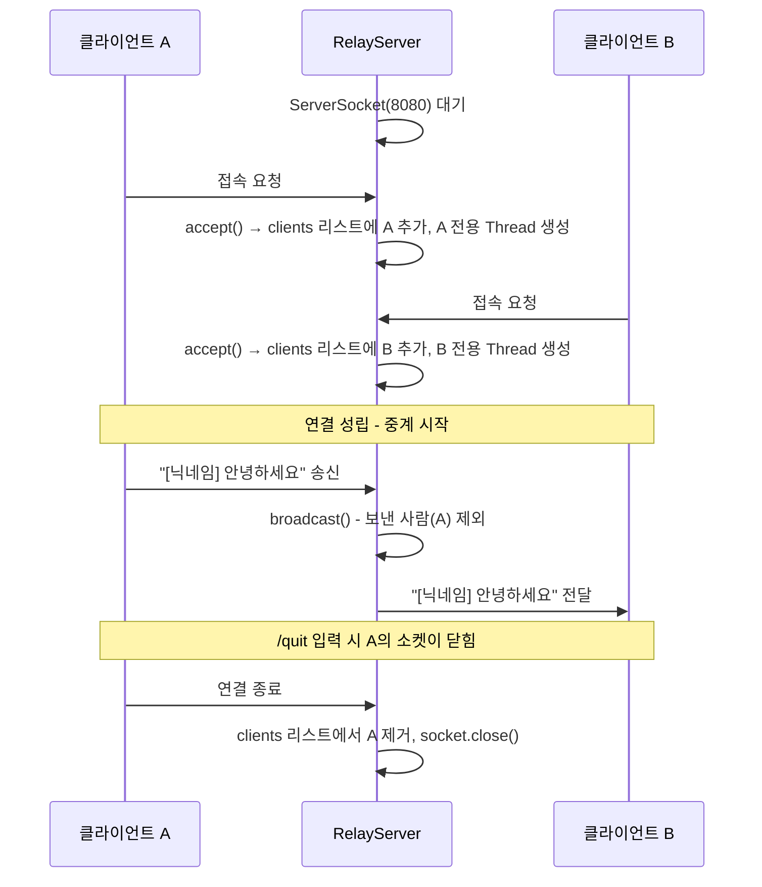

## 03. TCP 중계 채팅

### 목표
서버가 중계자 역할을 하여, 여러 클라이언트가 한 명이 보낸 메시지를 동시에 주고받는 1:다 채팅 구현하기.

### 1. 왜 이 프로젝트를 했는가?
1:1 채팅을 넘어서 1:다 구도로 차근차근 넘어가면서 구조를 익히고 싶었습니다.</br>
`01-tcp-chat`에서는 서버가 직접 대화에 참여했지만, 실제 채팅 서비스(카카오톡 단체방 등)는 서버가 대화에 끼지 않고 메시지를 받아서 다른 사람들에게 전달만 합니다.</br>
서버를 중계자로 두고 여러 클라이언트를 동시에 관리하는 구조를 직접 구현하며 이해하고 싶어서 해당 프로젝트를 시작했습니다.

### 2. 구조 설계
#### 2.1. 전체 구조


#### 2.2. 01-tcp-chat과의 차이점
| 구분        | 01-tcp-chat | 03-relay-chat |
|-----------|---|---------------|
| 서버 역할     | 직접 대화에 참여 | 메시지 전달만       |
| 클라이언트 수   | 1명 | 2명 이상         |
| 클라이언트 관리  | 변수 1개 | List로 여러 명 관리 |
| 서버 Thread | 1개 | 접속한 클라이언트 수만큼 |
| Broadcast | x | o             |

#### 2.3. 메시지 중계 흐름
`01-tcp-chat`은 한 번 연결된 이후 양쪽이 직접 대화하는 구조였지만</br> `03-relay-chat`은 서버가 가운데에서 메시지를 받아 다른 클라이언트에게 다시 뿌려주는 구조입니다.


#### 2.4. broadcast 설계
> broadcast란?</br>
> 한 클라이언트가 보낸 메시지를 **보낸 사람을 제외한 나머지 모든 클라이언트에게** 전달하는 동작.

`01-tcp-chat`에서는 상대가 1명뿐이라 이 개념 자체가 필요하지 않았지만 1:다 구조에서는 누구에게 다시 보낼지를 결정해야 하므로 별도 메서드로 분리했습니다.

**1) 출력 스트림을 List에 모아두기**</br>
broadcast가 동작하려면 *"지금 접속해 있는 모든 클라이언트의 출력 통로"*를 한 곳에서 알고 있어야 합니다.</br>
그래서 클라이언트가 접속할 때마다 그 클라이언트의 `PrintWriter`를 `clients` 리스트에 추가했습니다.
```java
private static List<PrintWriter> clients = new ArrayList<>();
// ...
PrintWriter out = new PrintWriter(socket.getOutputStream(), true);
clients.add(out);
```

**2) 보낸 사람을 제외하고 전달하기**</br>
리스트를 그대로 순회하면 보낸 본인에게도 메시지가 되돌아가므로 `sender`와 같은 스트림은 건너뛰도록 처리했습니다.
```java
private static void broadcast(String message, PrintWriter sender) {
    for (PrintWriter client : clients) {
        if (client != sender) {     // 보낸 사람에게는 다시 보내지 않음
            client.println(message);
        }
    }
}
```

**3) 연결 종료 시 리스트에서 제거하기**</br>
끊긴 클라이언트가 리스트에 남아 있으면 이후 broadcast 때 닫힌 스트림에 메시지를 보내려다 오류가 날 수 있습니다.</br>
그래서 클라이언트와의 연결이 끊겨 readLine()이 종료되는 시점에, `finally` 블록에서 리스트에서 제거하도록 했습니다.
```java
} finally {
    clients.remove(out);
    try {
        socket.close();
    } catch (IOException e) {
        e.printStackTrace();
    }
}
```
→ broadcast가 제대로 동작하려면 **리스트 등록 → 보낸 사람 제외 → 끊기면 제거**가 모두 갖춰져야 한다는 것을 알게 되었습니다.


### 3. 실행 방법
1. `RelayServer` 실행
2. `RelayChatClient` 실행 (1번째) → 닉네임 입력
3. `RelayChatClient` 추가 실행 (2번째) → 닉네임 입력
4. 한쪽에서 메시지 입력 → 다른 쪽에 출력

>`RelayChatClient` 다중으로 실행하는 방법 (IntelliJ 기준)
>  1. `RelayChatClient.java` 파일 열기
>  2. 상단 메뉴 Run → Edit Configurations
>  3. 왼쪽에서 `RelayChatClient` 선택
>  4. Modify options 클릭 → Allow multiple instances 체크
>  5. Apply → OK
>  6. `RelayChatClient`를 여러 번 실행하면 하단에 탭이 여러 개 생기는 것을 확인 할 수 있급니다.

### 4. 실행 화면
#### 4.1. RelayServer 실행
</br>
#### 4.2. RelayChatClient 실행 (1번째)
| | RelayServer | RelayChatClient |
|----------------------|--------------------|---|
|RelayChatClient 실행 시|||
|닉네임 입력 후 메시지 입력|||
#### 4.3. RelayChatClient 추가 실행 (2번째)
|                         | RelayServer | RelayChatClient |
|-------------------------|--------------------|-|
| RelayChatClient 추가 실행 시 |||
| 닉네임 입력 후 메시지 입력         |||


### 5. 문제 해결 사례
#### 5.1. java.net.BindException: Address already in use 에러
| 구분 | 설명                                                                                                                                                     |
|---|--------------------------------------------------------------------------------------------------------------------------------------------------------|
| 상황 | 재테스트를 위해 RelayServer를 종료한 후 다시 켰는데, 에러 메시지가 뜨며 제대로 켜지지 않았습니다.                                                                                          |
| 원인 | RelayServer가 사용하려는 8080 포트를 이미 다른 프로세스(또는 이전에 실행했던 서버)가 점유하고 있어서 발생하는 문제였습니다.</br>서버를 종료했더라도 프로세스가 백그라운드에 남아있거나, 운영체제에서 포트를 완전히 해제하지 않았을 때 자주 발생한다고 합니다. |
| 해결 | 점유 중인 포트 강제 종료하기.<br>`1) lsof -i :8080`<br>`2) PID 번호 확인`<br>`3) kill -9 [PID]`                                                    |

### 6. 배운 점
- 서버가 직접 대화에 참여하지 않고, **메시지를 받아 다른 클라이언트에게 전달만 하는 중계자 역할**을 할 수 있다는 것을 알게 되었습니다.</br>
  → 채팅 서비스의 기본 구조가 이 형태에 가깝다는 점을 직접 구현해보며 이해하게 되었습니다.
- 여러 클라이언트를 관리하려면 출력 스트림을 **List에 모아두고 `while(true) + accept()`로 접속을 계속 받아야** 한다는 것을 알게 되었습니다.</br>
  → 클라이언트마다 Thread를 1개씩 배정해야 여러 명의 메시지를 동시에 받을 수 있었습니다.
- broadcast는 **보낸 사람을 제외하고 전달**해야 하고, 연결이 끊긴 클라이언트는 List에서 제거해 자원을 정리해야 한다는 것을 확인했습니다.
- 1:다 구조에서는 메시지 보낸 사람을 구별하기 위해 **닉네임과 같은 식별 정보**가 필요하다는 것을 알게 되었습니다.